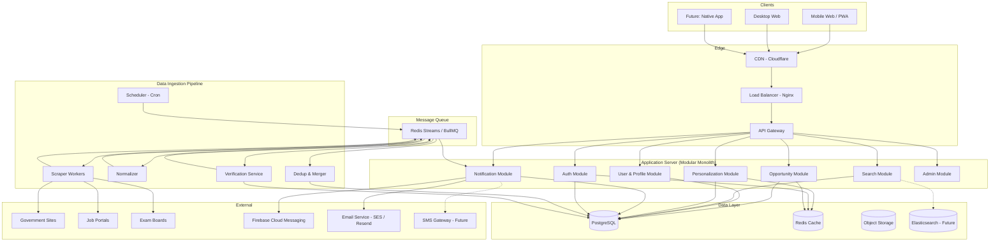
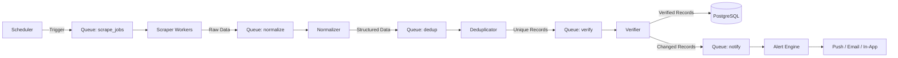
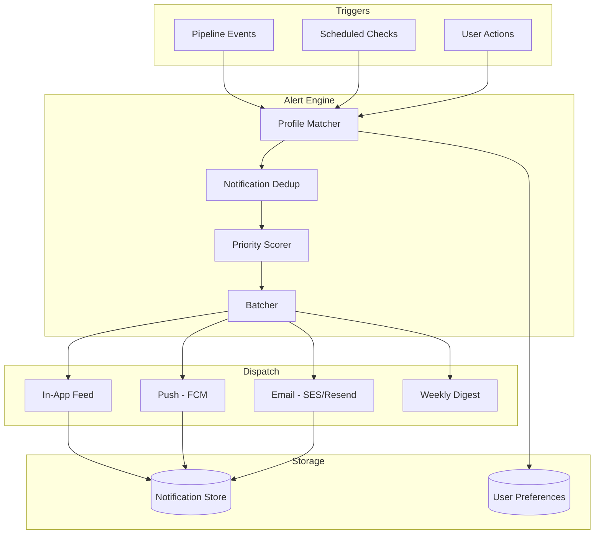

# SkillCase — System Architecture

> **Reference:** This document defines the technical architecture for SkillCase.
> All architectural decisions must be logged in [`context.md`](file:///Users/harsh/Desktop/SKILLCASE/MVP/docs/context.md).
>
> **Last updated:** 2026-08-27

---

## Table of Contents

- [Phase 0 — Validation-First Build](#phase-0--validation-first-build-recommended-starting-point)
- [Architecture Philosophy](#architecture-philosophy)
- [High-Level System Overview](#high-level-system-overview)
- [Architecture Diagram](#architecture-diagram)
- [Service Architecture](#service-architecture)
- [Data Layer](#data-layer)
- [Data Ingestion Pipeline](#data-ingestion-pipeline)
- [API Design](#api-design)
- [Personalization Engine](#personalization-engine)
- [Notification & Alerts System](#notification--alerts-system)
- [Search & Discovery](#search--discovery)
- [SEO & Organic Discovery](#seo--organic-discovery)
- [Caching Strategy](#caching-strategy)
- [Authentication & Security](#authentication--security)
- [Infrastructure & Deployment](#infrastructure--deployment)
- [Scalability Design](#scalability-design)
- [Monitoring & Observability](#monitoring--observability)
- [Database Schema](#database-schema)
- [Future Extensibility](#future-extensibility)
- [Disaster Recovery & Data Safety](#disaster-recovery--data-safety)
- [Tech Stack Summary](#tech-stack-summary)

---

## Architecture Philosophy

### Guiding Principles

| Principle | Rationale |
|---|---|
| **Modular monolith first, microservices later** | Start with clean module boundaries inside a single deployable unit. Split only when scale demands it. Avoids premature distributed-systems complexity. |
| **Event-driven data pipeline** | Ingestion, deduplication, verification, and alerting are inherently asynchronous. Decouple producers from consumers from day one. |
| **API-first** | Frontend and backend are fully decoupled via a versioned REST API. Enables mobile app, PWA, or third-party integrations without backend changes. |
| **Mobile-first** | Target users are Indian nurses — predominantly on Android, often on inconsistent networks. Every decision optimizes for mobile web (PWA). |
| **Data as the moat** | Structured, verified opportunity data is the long-term defensibility. The architecture treats data quality as a first-class concern at every layer. |
| **Horizontal scalability** | Stateless services, connection pooling, read replicas, and cache layers ensure the system handles concurrent user growth without re-architecture. |

---

## Phase 0 — Validation-First Build (Recommended Starting Point)

> **Read this before the rest of this document.** Everything below Phase 0 describes the architecture for a *validated, scaling* product. Building it before the retention hypothesis (see `context.md` → Core Hypothesis) is proven contradicts this project's own stated principle: *"MVP proves behaviour, not technology."* Phase 0 is deliberately smaller than "MVP" as architected further down — treat it as what to build **first**, with the rest of this document as the target to grow into once Phase 0 shows nurses return.

### What Phase 0 Cuts (and why)

| Full architecture (below) | Phase 0 instead | Why it can wait |
|---|---|---|
| Scraper workers per source | Manual curation (spreadsheet/admin form → DB, 2–3x/week) | Validates the Job/Exam schema and the product itself before investing in fragile, legally-sensitive scrapers ([context.md → Data Acquisition](context.md#data-acquisition--highest-risk-dependency)) |
| Personalization scoring engine | Simple filter (qualification + location dropdown, no scoring) | Can't validate a scoring algorithm's weights without real usage data anyway |
| Redis cache + BullMQ queues | None — direct DB reads, cron script for verification | Traffic at this stage doesn't need caching or async workers |
| Read replicas, PgBouncer | Single Postgres instance | Premature at 0 users |
| Push notifications (FCM) | Email only (Resend) | One channel is enough to test "do alerts drive return visits" |
| Admin module, audit log, moderation | Direct DB access / simple internal tool | Only the founder/small team is touching data at this stage |
| Elasticsearch, semantic search | Postgres `tsvector` (already MVP-scoped correctly below) | No change needed here |
| Full auth (JWT + OAuth + refresh rotation) | Email magic-link or simple session | Fewer moving parts while validating discovery, not security posture |

### What Phase 0 Does NOT Cut

These are frequently mistaken for "polish for later." They are not — each one either gates the validation itself or is a legal precondition.

| Not cut | Why it cannot wait |
|---|---|
| **Product analytics (PostHog)** | Phase 0's entire go/no-go depends on measuring 7-day return behaviour. Without cohort analytics you literally cannot evaluate your own gate. Infra monitoring cannot substitute |
| **SEO fundamentals** (SSR detail pages, `JobPosting` JSON-LD, sitemap, canonical slugs) | Organic search is the acquisition thesis. Indexing has a multi-week lag — starting it in Phase 1 means Phase 0 has no organic traffic to measure at all |
| **Privacy Policy, Terms, consent** | Legal precondition for collecting the very first email address ([`context.md` → Legal & Compliance](context.md#legal--compliance-applies-from-phase-0)) |
| **Trust signals** (Source, Official Link, Last Verified, Status) | The differentiator being tested. Cutting them tests a different product |
| **Scam/fee-request filtering** | A user-safety issue targeting a vulnerable audience — see Edge Case 10.2 |
| **WhatsApp share on every opportunity** | The fastest acquisition loop for this audience, and nearly free to build — a share button plus correct OG tags. Nurses already share opportunities constantly; the only question is whether the artifact is a screenshot or a SkillCase link |
| **Basic tracking ("I applied")** | The retention engine in its smallest form. Even a single stage field converts a one-off view into a reason to return, and Phase 0's whole purpose is measuring whether nurses return. Without it you are testing a lookup tool, not the product |

### Phase 0 Definition of Done

Ship when all of these are true, in this order:
1. ~30–50 real opportunities exist in the DB (manually curated) across 3–5 government sources + NORCET.
2. A nurse can browse, filter by qualification/location, and see the 5-question job detail (Section: MVP Screens → Job Detail).
3. A nurse can **track** an opportunity ("I applied") and see her tracked cycles in one view.
4. A nurse can share an opportunity to WhatsApp, and the link renders a rich preview.
5. A nurse can subscribe to email alerts, and tracked-cycle changes alert her specifically.
6. At least one real alert has been sent and opened by a real user.
7. You can answer both: *are users coming back after an alert?* **and** *are any coming back without one?*

**Only after (7) is answered "yes" repeatedly** does the investment in scrapers, personalization scoring, push notifications, and the full architecture below become justified. If (7) is "no," the fix is to the product/positioning, not to infrastructure — building the full architecture first would make that failure mode more expensive to discover.

> **On items 3–5.** These were added deliberately after the original cut-list, because Phase 0 without tracking and sharing tests a *job lookup tool* — and a job lookup tool is precisely the commoditised thing SkillCase intends to beat. Tracking is the retention hypothesis; sharing is the acquisition hypothesis. Testing neither leaves the gate measuring something that was never the strategy. Both are small: one stage field and one share button.

---

## High-Level System Overview

The system is composed of **five major subsystems**:

```
┌──────────────────────────────────────────────────────────────────────────┐
│                           CLIENT LAYER                                  │
│                                                                          │
│   ┌─────────────┐  ┌─────────────┐  ┌─────────────┐                    │
│   │  Mobile Web  │  │  Desktop Web│  │ Future: App │                    │
│   │    (PWA)     │  │  (Next.js)  │  │  (RN/Flutter│                    │
│   └──────┬──────┘  └──────┬──────┘  └──────┬──────┘                    │
│          └────────────────┼────────────────┘                             │
│                           │ HTTPS                                        │
└───────────────────────────┼──────────────────────────────────────────────┘
                            ▼
┌──────────────────────────────────────────────────────────────────────────┐
│                        EDGE / GATEWAY LAYER                             │
│                                                                          │
│   ┌──────────┐  ┌──────────────┐  ┌──────────────┐                     │
│   │   CDN    │  │ Load Balancer│  │  API Gateway  │                     │
│   │(CloudFla)│  │  (nginx)     │  │ (Rate Limit,  │                     │
│   └──────────┘  └──────────────┘  │  Auth, CORS)  │                     │
│                                    └───────┬──────┘                      │
└────────────────────────────────────────────┼─────────────────────────────┘
                                             ▼
┌──────────────────────────────────────────────────────────────────────────┐
│                      APPLICATION LAYER                                   │
│                                                                          │
│  ┌────────────┐ ┌────────────┐ ┌────────────┐ ┌────────────────────┐   │
│  │  Auth      │ │ Opportunity│ │ User       │ │ Notification       │   │
│  │  Module    │ │ Module     │ │ Module     │ │ Module             │   │
│  └────────────┘ └────────────┘ └────────────┘ └────────────────────┘   │
│  ┌────────────┐ ┌────────────┐ ┌────────────┐                         │
│  │  Search    │ │ Personaliz │ │ Admin      │                         │
│  │  Module    │ │ Module     │ │ Module     │                         │
│  └────────────┘ └────────────┘ └────────────┘                         │
└──────────────────────────┬───────────────────────────────────────────────┘
                           ▼
┌──────────────────────────────────────────────────────────────────────────┐
│                       DATA PIPELINE LAYER                                │
│                                                                          │
│  ┌────────────┐ ┌────────────┐ ┌────────────┐ ┌────────────────────┐   │
│  │  Scrapers  │ │ Normalizer │ │ Dedup &    │ │ Verification       │   │
│  │  Workers   │ │ Service    │ │ Merger     │ │ Service            │   │
│  └─────┬──────┘ └─────┬──────┘ └─────┬──────┘ └────────┬───────────┘   │
│        └───────────────┴──────────────┴─────────────────┘               │
│                           ▼ (Message Queue)                              │
└──────────────────────────────────────────────────────────────────────────┘
                           ▼
┌──────────────────────────────────────────────────────────────────────────┐
│                        DATA LAYER                                        │
│                                                                          │
│  ┌──────────────┐  ┌──────────┐  ┌──────────┐  ┌──────────────────┐   │
│  │ PostgreSQL   │  │  Redis   │  │  S3/GCS  │  │  Elasticsearch   │   │
│  │ (Primary DB) │  │ (Cache)  │  │ (Assets) │  │  (Search - Stg2) │   │
│  └──────────────┘  └──────────┘  └──────────┘  └──────────────────┘   │
└──────────────────────────────────────────────────────────────────────────┘
```

---

## Architecture Diagram



---

## Service Architecture

### Modular Monolith Design

The MVP uses a **modular monolith** — a single deployable application with strictly separated internal modules. Each module has its own routes, services, repositories, and can be extracted into an independent microservice if scale demands it.

```
src/
├── modules/
│   ├── auth/
│   │   ├── auth.controller.ts
│   │   ├── auth.service.ts
│   │   ├── auth.repository.ts
│   │   ├── auth.routes.ts
│   │   ├── auth.middleware.ts
│   │   └── auth.types.ts
│   ├── opportunity/
│   │   ├── opportunity.controller.ts
│   │   ├── opportunity.service.ts
│   │   ├── opportunity.repository.ts
│   │   ├── opportunity.routes.ts
│   │   ├── job.service.ts
│   │   ├── exam.service.ts
│   │   └── opportunity.types.ts
│   ├── user/
│   │   ├── user.controller.ts
│   │   ├── user.service.ts
│   │   ├── user.repository.ts
│   │   ├── profile.service.ts
│   │   └── user.types.ts
│   ├── search/
│   │   ├── search.controller.ts
│   │   ├── search.service.ts
│   │   ├── filter.service.ts
│   │   └── search.types.ts
│   ├── personalization/
│   │   ├── personalization.controller.ts
│   │   ├── personalization.service.ts
│   │   ├── relevance.engine.ts
│   │   └── personalization.types.ts
│   ├── notification/
│   │   ├── notification.controller.ts
│   │   ├── notification.service.ts
│   │   ├── alert.service.ts
│   │   ├── push.provider.ts
│   │   ├── email.provider.ts
│   │   └── notification.types.ts
│   └── admin/
│       ├── admin.controller.ts
│       ├── admin.service.ts
│       └── admin.routes.ts
├── pipeline/
│   ├── scheduler/
│   │   └── cron.manager.ts
│   ├── scrapers/
│   │   ├── base.scraper.ts
│   │   ├── government.scraper.ts
│   │   ├── private-jobs.scraper.ts
│   │   └── exam.scraper.ts
│   ├── normalizer/
│   │   └── data.normalizer.ts
│   ├── dedup/
│   │   └── dedup.service.ts
│   └── verification/
│       └── verification.service.ts
├── shared/
│   ├── database/
│   │   ├── connection.ts
│   │   ├── migrations/
│   │   └── seeds/
│   ├── cache/
│   │   └── redis.client.ts
│   ├── queue/
│   │   └── queue.manager.ts
│   ├── middleware/
│   │   ├── rate-limiter.ts
│   │   ├── cors.ts
│   │   ├── error-handler.ts
│   │   └── request-logger.ts
│   ├── utils/
│   └── config/
│       ├── env.ts
│       └── constants.ts
└── app.ts
```

### Module Communication Rules

| Rule | Description |
|---|---|
| **No direct imports** | Modules communicate through well-defined service interfaces, never by importing another module's repository directly |
| **Shared DB, separate schemas** | All modules use the same PostgreSQL instance but own their own tables. No cross-module JOINs in repositories — use service calls |
| **Event bus for side effects** | When Module A's action should trigger Module B (e.g., new job → send alert), use the internal event bus / message queue, not direct calls |
| **Shared kernel** | Common types, utilities, config, and middleware live in `shared/` |

---

## Data Layer

### Database Selection: PostgreSQL

| Requirement | Why PostgreSQL |
|---|---|
| Structured opportunity data (Job, Exam) | Strong relational schema, constraints, foreign keys |
| Complex filtering (qualification + location + experience + type) | Powerful query planner, composite indexes, partial indexes |
| Full-text search (MVP) | Built-in `tsvector` / `tsquery` — good enough for MVP without Elasticsearch |
| JSONB for flexible fields | Government notifications have varying structures — JSONB handles schema variations |
| Geospatial (future) | PostGIS for location-based queries |
| Proven at scale | Handles millions of rows with proper indexing; read replicas for horizontal read scaling |

### Redis

| Use Case | Details |
|---|---|
| **API response caching** | Cache opportunity lists, search results (TTL: 5–15 minutes) |
| **Session store** | JWT refresh tokens, active sessions |
| **Rate limiting** | Sliding window rate limiter per user/IP |
| **Queue backend** | BullMQ job queue for pipeline workers |
| **Real-time counters** | View counts, trending opportunities |
| **Pub/Sub** | Internal event bus for module communication |

### Object Storage (S3/GCS)

| Use Case | Details |
|---|---|
| Official notification PDFs | Cached copies of government notification documents |
| User resumes (Stage 3) | Uploaded resume files |
| Pipeline artifacts | Raw scraped HTML/data for audit trail |
| Static assets | Images, icons, etc. served via CDN |

### Elasticsearch (Stage 2+)

Not MVP. Introduced when search volume and complexity exceed PostgreSQL's full-text capabilities.

---

## Data Ingestion Pipeline

The pipeline is the backbone of the product. It runs **asynchronously** and **independently** from the application server.

### Pipeline Flow



### Pipeline Stages

#### Stage 1 — Scheduling

```
┌─────────────────────────────────────────────────────────┐
│ SCHEDULER (Cron-based)                                   │
│                                                           │
│ Government sites    → every 6 hours                      │
│ Private job portals → every 4 hours                      │
│ Exam boards         → every 6 hours                      │
│ High-priority       → every 1 hour (deadline approaching)│
│ Health check        → every 30 minutes                   │
└─────────────────────────────────────────────────────────┘
```

- Managed via BullMQ repeatable jobs
- Priority-based: opportunities with approaching deadlines get higher scrape frequency
- Staggered to avoid thundering herd

#### Stage 2 — Scraping / Extraction

```
┌─────────────────────────────────────────────────────────┐
│ SCRAPER WORKERS (Pluggable)                              │
│                                                           │
│ Each source gets its own scraper plugin:                  │
│                                                           │
│   GovernmentScraper extends BaseScraper                   │
│   ├── AiimsScraper                                       │
│   ├── EsicScraper                                        │
│   ├── NorcetScraper                                      │
│   ├── RrbScraper                                         │
│   ├── NhmScraper                                         │
│   └── StatePscScraper                                    │
│                                                           │
│   PrivateJobScraper extends BaseScraper                   │
│   ├── NaukriScraper                                      │
│   ├── IndeedScraper                                      │
│   └── HospitalDirectScraper                              │
│                                                           │
│   ExamScraper extends BaseScraper                        │
│   ├── NorcetExamScraper                                  │
│   └── StateExamScraper                                   │
│                                                           │
│ BaseScraper provides:                                    │
│   - HTTP client with retry & backoff                     │
│   - robots.txt respect                                   │
│   - Rate limiting per domain                             │
│   - Error capture & dead-letter queue                    │
│   - Raw data archival to object storage                  │
└─────────────────────────────────────────────────────────┘
```

- Each scraper is a separate worker class extending `BaseScraper`
- Pluggable: adding a new source = adding a new scraper class + config
- Workers are horizontally scalable — add more instances for more throughput
- All raw scraped data is archived to object storage for audit trail

#### Stage 3 — Normalization

Converts raw heterogeneous data into the canonical Job/Exam schema.

```
Raw HTML / JSON / PDF
        ↓
   ┌─────────────┐
   │ Normalizer   │
   │              │
   │ • Extract    │ → Structured fields (title, employer, qualification...)
   │ • Classify   │ → Government vs Private, Role type
   │ • Clean      │ → Trim, standardize dates, normalize locations
   │ • Enrich     │ → Map qualification codes, salary ranges
   │ • Validate   │ → Required field checks, schema validation
   └─────────────┘
        ↓
   Canonical Job / Exam object
```

#### Stage 4 — Deduplication & Merging

```
┌─────────────────────────────────────────────────────────┐
│ DEDUPLICATION STRATEGY                                   │
│                                                           │
│ Exact match:   Hash(employer + title + location + date)  │
│ Fuzzy match:   Similarity score on title + employer      │
│ Merge policy:  Keep most complete record, preserve all   │
│                source URLs, take latest deadline          │
│                                                           │
│ Output:                                                   │
│   NEW      → Insert into DB, emit "new_opportunity"      │
│   UPDATED  → Update in DB, emit "opportunity_changed"    │
│   DUPLICATE → Skip, log                                  │
│   EXPIRED  → Mark status = "expired"                     │
└─────────────────────────────────────────────────────────┘
```

#### Stage 5 — Verification

```
┌─────────────────────────────────────────────────────────┐
│ VERIFICATION SERVICE                                     │
│                                                           │
│ For each opportunity:                                    │
│   1. Check official source URL is reachable              │
│   2. Check application link is live                      │
│   3. Check deadline hasn't passed                        │
│   4. Assign source_type: Official / Verified / Other     │
│   5. Set last_verified timestamp                         │
│   6. Flag stale records (>48h not re-verified)           │
│                                                           │
│ Periodic re-verification:                                │
│   Active opportunities → every 12 hours                  │
│   Closing soon (<7 days) → every 6 hours                 │
│   Expired → once, then archived                          │
└─────────────────────────────────────────────────────────┘
```

#### Stage 6 — Alert Dispatch

When the pipeline emits events (`new_opportunity`, `opportunity_changed`, `deadline_approaching`), the Alert Engine matches them against user profiles and dispatches personalized notifications.

Detailed in [Notification & Alerts System](#notification--alerts-system).

---

## API Design

### API Principles

| Principle | Detail |
|---|---|
| RESTful | Resource-oriented endpoints |
| Versioned | `/api/v1/` prefix — never break existing clients |
| Paginated | Cursor-based pagination for lists (not offset-based — more performant at scale) |
| Filtered | Consistent query parameter syntax for filtering |
| Rate limited | Per-user and per-IP limits |
| Cached | ETags and Cache-Control headers for client-side caching |

### Core Endpoints

```
AUTH
  POST   /api/v1/auth/register           → Create account
  POST   /api/v1/auth/login              → Login (returns JWT)
  POST   /api/v1/auth/refresh            → Refresh access token
  POST   /api/v1/auth/logout             → Invalidate session
  POST   /api/v1/auth/forgot-password    → Password reset flow

USER & PROFILE
  GET    /api/v1/me                      → Get current user
  PATCH  /api/v1/me                      → Update profile / Career Passport
  POST   /api/v1/me/resume/parse         → Upload & parse resume into Career Passport draft
  POST   /api/v1/me/passport/confirm     → Confirm extracted passport fields with provenance
  GET    /api/v1/me/preferences          → Get personalization prefs
  PUT    /api/v1/me/preferences          → Set personalization prefs
  GET    /api/v1/me/saved                → List saved opportunities (?type=job|exam)
  DELETE /api/v1/me                      → Delete account (cascades all user data — see DPDP requirements)

JOBS
  GET    /api/v1/jobs                    → List jobs (paginated, filtered)
  GET    /api/v1/jobs/featured           → Featured/trending jobs  [static — MUST be registered before /:id]
  GET    /api/v1/jobs/:id                → Job detail
  POST   /api/v1/jobs/:id/save           → Save job
  DELETE /api/v1/jobs/:id/save           → Unsave job

  ⚠️ ROUTE ORDERING: static segments (/featured) must be registered BEFORE the
     parameterized /:id route, or ":id" will capture "featured" and shadow it.
     Saved opportunities are deliberately namespaced under /me (below) rather
     than /jobs/saved, which would collide with /jobs/:id.

  Query params:
    ?type=government|private
    ?qualification=bsc_nursing|gnm|post_basic|msc|other
    ?experience=fresher|0-2|2-5|5+
    ?location=state:karnataka|city:bangalore
    ?status=open|upcoming|closed
    ?sort=relevance|deadline|newest
    ?cursor=<cursor_token>
    ?limit=20

EXAMS
  GET    /api/v1/exams                   → List exams (paginated, filtered)
  GET    /api/v1/exams/:id               → Exam detail
  POST   /api/v1/exams/:id/alert         → Subscribe to exam alerts
  DELETE /api/v1/exams/:id/alert         → Unsubscribe from exam alerts

  Query params:
    ?status=application_open|upcoming|result_released
    ?sort=deadline|exam_date|newest
    ?cursor=<cursor_token>

OPPORTUNITIES (Unified)
  GET    /api/v1/opportunities           → Unified feed (jobs + exams)
  GET    /api/v1/opportunities/for-you   → Personalized recommendations

TRACKING  (the retention engine — see context.md → The Retention Engine)
  GET    /api/v1/me/cycles               → "My Cycles": active tracked opportunities,
                                           each with its next upcoming stage + date
  GET    /api/v1/me/changes              → "What changed since you last checked"
                                           (stage changes on tracked cycles first,
                                            then new matches). Drives the Home screen
  POST   /api/v1/jobs/:id/track          → Start tracking (body: stage)
  POST   /api/v1/exams/:id/track         → Start tracking
  PATCH  /api/v1/tracked/:id             → Update stage / outcome / notes
  DELETE /api/v1/tracked/:id             → Stop tracking

SHARING  (acquisition loop 2)
  POST   /api/v1/jobs/:id/share          → Mint a share token (body: channel)
  POST   /api/v1/exams/:id/share         → Mint a share token
    Shared URLs carry ?s=<token>; visits and signups attribute back to the share.
    Shared opportunity pages MUST render fully without auth — no login wall, ever.

SEARCH
  GET    /api/v1/search?q=<query>        → Full-text search across jobs + exams

NOTIFICATIONS
  GET    /api/v1/notifications           → User's notification feed
  PATCH  /api/v1/notifications/:id/read  → Mark as read
  POST   /api/v1/notifications/read-all  → Mark all as read
  GET    /api/v1/notifications/settings  → Alert preferences
  PUT    /api/v1/notifications/settings  → Update alert preferences

ALERTS
  GET    /api/v1/alerts                  → Active alert subscriptions
  POST   /api/v1/alerts                  → Create custom alert
  DELETE /api/v1/alerts/:id              → Remove alert

ADMIN (Protected)
  GET    /api/v1/admin/pipeline/status   → Pipeline health
  POST   /api/v1/admin/pipeline/trigger  → Manual scrape trigger
  GET    /api/v1/admin/opportunities     → CRUD with moderation
  GET    /api/v1/admin/metrics           → System metrics
  GET    /api/v1/admin/reports           → User-reported issues
```

### API Response Format

```json
{
  "status": "success",
  "data": { },
  "meta": {
    "page": {
      "cursor": "eyJpZCI6MTAwfQ==",
      "has_next": true,
      "total_count": 342
    },
    "timestamp": "2026-08-27T10:30:00Z"
  }
}
```

### Error Response Format

```json
{
  "status": "error",
  "error": {
    "code": "VALIDATION_ERROR",
    "message": "Qualification is required",
    "details": [
      { "field": "qualification", "message": "Must be one of: gnm, bsc_nursing, post_basic, msc" }
    ]
  }
}
```

---

## Personalization Engine

### MVP Personalization (Stage 1)

The personalization engine is a **scoring-based relevance system** that ranks opportunities against the user's profile.

```
┌──────────────────────────────────────────────────────────────┐
│ USER PROFILE                OPPORTUNITY                      │
│                                                              │
│ qualification: bsc_nursing  qualification: bsc_nursing  ✅   │
│ experience: 2-5             experience: 1+ years        ✅   │
│ location: karnataka         location: bangalore         ✅   │
│ preference: government      type: government            ✅   │
│                                                              │
│ RELEVANCE SCORE: 0.95 → "Strong match"                      │
└──────────────────────────────────────────────────────────────┘
```

### Scoring Algorithm

```
relevance_score = (
    qualification_match  × 0.35  +    // Conditional filter — see rules below
    experience_match     × 0.25  +    // Bucket → numeric range check
    location_match       × 0.20  +    // State → City hierarchy (never a hard filter)
    preference_match     × 0.15  +    // Government/Private/Both
    recency_boost        × 0.05       // Newer opportunities score higher
)

Thresholds:
  ≥ 0.80  → "Strong match"
  ≥ 0.50  → "Possible match"
  < 0.50  → "May not match" (still shown, lower in feed)
```

> ⚠️ **These weights are unvalidated defaults.** Per `implementation_plan.md` Phase 2, they must be checked against real click/save data before being trusted. Do not treat the 0.35/0.25/0.20/0.15/0.05 split as settled.

#### Qualification — Conditional Filter, Not an Unconditional One

Qualification hard-filters **only when both sides are known and unambiguous**:

| Nurse's qualification | Opportunity requirement | Behaviour |
|---|---|---|
| Known (GNM/BSc/PB-BSc/MSc) | Known and unambiguous | Hard filter — exclude if it doesn't match |
| `Other / Not sure` | Any | **Never exclude.** Show with a "Check requirements" label |
| Known | Ambiguous, multi-option, or missing | **Never exclude.** Show with a "Check requirements" label |

A nurse with a non-standard, foreign, or in-progress credential must never be silently removed from the feed — an empty feed reads as "no opportunities exist," not "we couldn't classify you."

#### Experience — Bucket to Numeric Range

Profiles store a bucket; `jobs` stores `experience_min` / `experience_max` integers. The canonical bucket boundaries live in [`context.md` → Canonical Definitions](context.md#canonical-definitions--experience-buckets). The mapping used for scoring:

| Bucket | Numeric range | `experience_match` score |
|---|---|---|
| `fresher` | `[0, 0]` | `1.0` if `job.experience_min == 0`, else `0.0` |
| `0-2` | `(0, 2)` | `1.0` if bucket lower bound ≥ `experience_min`; `0.5` if the bucket spans `experience_min`; else `0.0` |
| `2-5` | `[2, 5)` | same rule |
| `5+` | `[5, ∞)` | same rule |

A `0.5` (partial) score means the nurse **may** qualify — surface as "Check requirements", never as an exclusion.

#### Location — Never a Hard Filter

Location contributes weight (0.20) but must not exclude. A nurse whose preference indicates relocation flexibility (or who has set no location) must still see out-of-state opportunities, demoted rather than hidden.

### Eligibility Check

For each opportunity, the system generates a structured eligibility assessment:

```json
{
  "eligible": false,
  "confidence": "likely",
  "label": "Not eligible yet",
  "requirements": [
    { "kind": "qualification", "status": "met",
      "detail": "BSc Nursing meets the requirement" },
    { "kind": "experience", "status": "not_met",
      "detail": "Requires 3 years; your profile says 2–5 (lower bound 2)",
      "remedy": "About 1 more year of experience would meet this" },
    { "kind": "registration", "status": "unknown",
      "detail": "We could not verify state council registration",
      "remedy": "Check your registration status with your state council" }
  ],
  "gap_summary": "One requirement unmet, one unverified.",
  "next_actions": [
    "Confirm your state council registration",
    "Set an alert — you'll likely qualify for this recruiter's next cycle"
  ]
}
```

> **`unknown` is a first-class state.** It must never collapse into `met` or `not_met`. A nurse deciding whether to pay an application fee is better served by an honest "we couldn't verify this" than by a confident wrong answer — and this is the field the AI assistant must be forbidden from smoothing over.

### Future Extension Points

| Stage | Extension |
|---|---|
| Stage 2 | Weight personalization by user behavior (clicks, saves, applications) |
| Stage 3 | Resume-based deep matching with skill extraction |
| Stage 4 | Market-aware scoring (demand, salary trends) |
| Stage 5 | AI-powered career recommendations |

---

## Notification & Alerts System

### Architecture



### Alert Types

| Type | Trigger | Priority |
|---|---|---|
| **Tracked-cycle stage change** | A stage advances on an opportunity the nurse is **tracking** (her admit card is out, her result is published) | **Critical — highest value alert in the product** |
| **Tracked-cycle deadline** | Deadline approaching on something she is tracking | Critical |
| **New opportunity match** | Pipeline ingests job/exam matching user profile | Medium |
| **Deadline approaching** | Scheduled check: deadline within 3 days (untracked) | High |
| **Deadline tomorrow** | Scheduled check: deadline is tomorrow (untracked) | High |
| **Status change** | Pipeline detects change (result released, admit card out) on an untracked opportunity | Medium |
| **Exam update** | User subscribed to exam, and exam details changed | High |
| **Weekly digest** | Scheduled: every Monday 9 AM IST | Low |

> **Priority rule.** An alert about something the nurse is *tracking* always outranks a generic new-match alert. "Your AIIMS admit card is out" is unmissable; "3 new jobs match your profile" is noise by comparison. Tracked-cycle alerts are the ones that must never be batched away, delayed, or lost in a digest — they are the reason she trusts the product enough to stop checking elsewhere.

### Notification Dedup Rules

- Same opportunity + same user → max 1 notification per 24 hours
- Same exam + same event type → max 1 per event
- Weekly digest consolidates all low-priority updates

### User Preferences

```json
{
  "push_enabled": true,
  "email_enabled": true,
  "digest_enabled": true,
  "alert_categories": {
    "new_government_jobs": true,
    "new_private_jobs": true,
    "exam_updates": true,
    "deadline_reminders": true,
    "results": true
  },
  "quiet_hours": {
    "start": "22:00",
    "end": "07:00"
  }
}
```

---

## Search & Discovery

### MVP: PostgreSQL Full-Text Search

```sql
-- Search index on jobs
ALTER TABLE jobs ADD COLUMN search_vector tsvector
    GENERATED ALWAYS AS (
        setweight(to_tsvector('english', coalesce(title, '')), 'A') ||
        setweight(to_tsvector('english', coalesce(employer, '')), 'B') ||
        setweight(to_tsvector('english', coalesce(role, '')), 'C') ||
        setweight(to_tsvector('english', coalesce(location, '')), 'C')
    ) STORED;

CREATE INDEX idx_jobs_search ON jobs USING GIN(search_vector);

-- Query
SELECT *, ts_rank(search_vector, plainto_tsquery('english', $1)) AS rank
FROM jobs
WHERE search_vector @@ plainto_tsquery('english', $1)
  AND status = 'open'
ORDER BY rank DESC
LIMIT 20;
```

### Filter System

Composable filters applied as WHERE clauses with proper indexing:

```
Filters available:
  ├── type         (government / private)
  ├── qualification (gnm / bsc / post_basic / msc / other — 'other' never excludes)
  ├── experience   (fresher / 0-2 / 2-5 / 5+)
  ├── location     (state / city)
  ├── role         (staff_nurse / icu / ot / emergency / ward)
  ├── status       (open / upcoming / closed / expired)
  ├── salary_range (min / max)
  └── posted_after (date)
```

### Search Strategy at Scale

| Phase | Approach | When |
|---|---|---|
| MVP | PostgreSQL `tsvector` + GIN indexes | 0–50K opportunities |
| Growth | Elasticsearch with synonym support, Hindi/regional tokenization | 50K+ or complex search needs |
| Future | AI semantic search (vector embeddings) | Stage 5 |

---

## SEO & Organic Discovery

> **This is the primary acquisition channel and it requires real implementation.** The MVP User Journey starts at `SEARCH`, and Next.js was chosen specifically for SSR/SEO — but SSR alone does not produce organic traffic. Without the below, the acquisition thesis is unbuilt.

### Rendering Strategy

| Page type | Rendering | Why |
|---|---|---|
| Job detail | SSG with ISR (revalidate ~1h) | Must be crawlable and fast; content changes rarely between verifications |
| Exam detail | SSG with ISR (revalidate ~1h) | Same |
| Job/Exam lists (unfiltered, unauthenticated) | SSR | Crawlable category pages that link to detail pages |
| Personalized feed (`/for-you`), profile, alerts | CSR, `noindex` | User-specific — must never be indexed |

### URL Structure

```
/{profession}/jobs/{slug}     e.g. /nursing/jobs/aiims-delhi-nursing-officer-2026
/{profession}/exams/{slug}    e.g. /nursing/exams/norcet-2026
/{profession}/jobs/government
/{profession}/jobs/private
/{profession}/jobs/state/{state}   e.g. /nursing/jobs/state/karnataka
```

> ⚠️ **The profession segment is mandatory from day one**, even though nursing is the only profession in the MVP (`context.md` → Multi-Profession by Design). Public URLs are the hardest thing to change after launch — they are indexed by Google, shared in WhatsApp, and cited by AI assistants. Adding the segment later means 301-ing every URL and forfeiting accumulated SEO equity. Today it costs one path segment.
>
> `/` and bare `/jobs/...` should redirect to the nursing equivalents, so nursing remains the default experience with no added user-facing complexity.

- Slugs are **stable and human-readable** — generated from title + employer + year. Never expose raw UUIDs in public URLs.
- Slug is stored on the record; if a title is later corrected, the original slug must **301 redirect** to the new one rather than breaking the indexed URL.
- `<link rel="canonical">` on every detail page to prevent duplicate-content dilution across filter permutations.

### Structured Data (Critical)

Every job detail page emits **schema.org `JobPosting` JSON-LD**. This is the actual mechanism for appearing in Google Jobs — SSR without it does not get you there.

```json
{
  "@context": "https://schema.org/",
  "@type": "JobPosting",
  "title": "Nursing Officer",
  "hiringOrganization": { "@type": "Organization", "name": "AIIMS Delhi" },
  "jobLocation": { "@type": "Place", "address": {
      "@type": "PostalAddress", "addressLocality": "New Delhi",
      "addressRegion": "Delhi", "addressCountry": "IN" } },
  "datePosted": "2026-08-20",
  "validThrough": "2026-09-18",
  "employmentType": "FULL_TIME",
  "educationRequirements": "BSc Nursing",
  "directApply": false
}
```

- `validThrough` **must** be populated from `application_deadline` — Google demotes and eventually drops postings without it.
- `directApply: false` is required, since applications happen on the official source, not on SkillCase. Misrepresenting this violates Google's JobPosting policy.

### Indexation Lifecycle

| Opportunity status | HTTP | Robots | Sitemap |
|---|---|---|---|
| Open | 200 | `index, follow` | Included |
| Upcoming | 200 | `index, follow` | Included |
| Closed (recently) | 200 | `noindex` + visible "This opportunity has closed" + links to similar open ones | Removed |
| Expired / archived | `410 Gone` | — | Removed |

> Never leave an expired listing indexed and returning 200 as though live — it is simultaneously an SEO penalty and a direct violation of the product's Trust philosophy.

### `sitemap.xml` & `robots.txt`

- Sitemap auto-generated from open/upcoming opportunities, regenerated on ingestion, split into an index if it exceeds 50,000 URLs.
- `robots.txt` allows `/{profession}/jobs/*` and `/{profession}/exams/*` (i.e. `/nursing/jobs/*`, `/nursing/exams/*`); disallows `/api/*`, `/admin/*`, `/for-you`, `/profile`, `/cycles`, `/alerts`, and any URL carrying a `?s=` share token (to avoid indexing attribution variants of canonical pages).

### Social Sharing

Open Graph + Twitter Card tags on every detail page. WhatsApp and Telegram are the dominant sharing channels for this audience — a shared link with no preview loses most of its click-through. Test rendering in WhatsApp specifically, not just Twitter.

### Answer-Engine Visibility (GEO)

Nurses increasingly ask ChatGPT, Perplexity, and Google AI Overviews before opening a website (`context.md` → Acquisition Loop 4). Being the cited source puts us at the moment of intent.

| Requirement | Implementation |
|---|---|
| **`FAQPage` / `QAPage` JSON-LD** | On eligibility and process pages, alongside `JobPosting` |
| **`llms.txt`** at the root | Plain-text map of authoritative, stable pages for AI crawlers |
| **Question-shaped headings** | `<h1>Who is eligible for NORCET 2026?</h1>` — answered in the first paragraph, not after preamble |
| **Extractable facts** | Short factual sentences and tables; answer engines lift clean facts and skip marketing prose |
| **Visible `last verified` dates** | Recency is heavily weighted for deadline-sensitive facts |
| **Deliberate AI-crawler policy** | Decide explicitly in `robots.txt`. Blocking GPTBot/PerplexityBot/Google-Extended forfeits this channel — make it a choice, not an accident |
| **Separate measurement** | Track referrals from AI surfaces distinctly from organic search; citation without click-through still builds awareness but is not traffic |

### Explicitly Deferred

Paid acquisition, backlink building, blog/content SEO, regional-language SEO (see Search Strategy at Scale for the related search limitation).

---

## Caching Strategy

### Cache Layers

```
┌─────────────┐     ┌─────────────┐     ┌─────────────┐
│  Browser /   │     │   CDN       │     │   Redis     │
│  Service     │ ──▶ │   Edge      │ ──▶ │   Cache     │ ──▶ PostgreSQL
│  Worker      │     │   Cache     │     │             │
│  Cache       │     │             │     │             │
└─────────────┘     └─────────────┘     └─────────────┘
   ~seconds           ~minutes           ~5-15 min
```

### Cache Policies

| Resource | Cache Location | TTL | Invalidation |
|---|---|---|---|
| Job listings (paginated) | Redis | 5 min | On new ingestion |
| Exam listings | Redis | 10 min | On new ingestion |
| Job detail | Redis | 15 min | On update |
| Search results | Redis | 5 min | Hash of query params |
| For-you feed | Redis | 10 min | On profile change |
| Static assets | CDN | 30 days | Content hash in URL |
| API docs | CDN | 24 hours | Manual purge |
| User session | Redis | 7 days | On logout |

### Cache Invalidation Strategy

- **Pipeline-driven:** When the ingestion pipeline writes/updates a record, it publishes a cache invalidation event to Redis Pub/Sub
- **TTL-based:** All cached items have a TTL as a safety net
- **User-action-driven:** Profile change → invalidate personalized feed cache

---

## Authentication & Security

### Auth Architecture

```
┌──────────────────────────────────────────────────────────┐
│ Authentication Flow                                       │
│                                                           │
│ Register / Login                                         │
│        ↓                                                  │
│ Server validates credentials                             │
│        ↓                                                  │
│ Issue JWT access token (15 min) + refresh token (30 days)│
│        ↓                                                  │
│ Access token in Authorization header                     │
│ Refresh token in HTTP-only cookie                        │
│        ↓                                                  │
│ On expiry → /auth/refresh → new access token             │
└──────────────────────────────────────────────────────────┘
```

### Auth Methods (MVP)

| Method | Detail |
|---|---|
| **Email + Password** | Standard registration with email verification |
| **OTP via Email** | Passwordless login option (mobile-friendly) |
| **Google OAuth** | Social login (most nurses have Google accounts) |
| **Phone OTP (Stage 2)** | SMS-based auth for users without email comfort |

### Security Measures

| Measure | Implementation |
|---|---|
| **Password hashing** | bcrypt (cost factor 12) |
| **JWT** | RS256 signed, 15-min expiry, refresh rotation |
| **Rate limiting** | 100 req/min per user, 30 req/min per IP for auth endpoints |
| **CORS** | Whitelist allowed origins |
| **Input validation** | Zod schema validation on all inputs |
| **SQL injection** | Parameterized queries only (via ORM) |
| **XSS** | Content Security Policy headers, output encoding |
| **CSRF** | SameSite cookies + CSRF tokens for state-changing ops |
| **Helmet** | Security headers (HSTS, X-Frame-Options, etc.) |
| **Data encryption** | TLS 1.3 in transit, AES-256 at rest (for PII) |
| **Audit log** | Log all admin actions, data modifications |

---

## Infrastructure & Deployment

### Environment Layout

```
┌────────────────────────────────────────────────────┐
│ PRODUCTION                                          │
│                                                      │
│  ┌─────────────┐  ┌─────────────┐                  │
│  │ App Server  │  │ App Server  │  (2+ instances)  │
│  │ Instance 1  │  │ Instance 2  │                  │
│  └──────┬──────┘  └──────┬──────┘                  │
│         └────────┬───────┘                          │
│                  ▼                                   │
│         ┌──────────────┐                            │
│         │ Load Balancer│                            │
│         └──────────────┘                            │
│                                                      │
│  ┌──────────────┐  ┌──────────────┐                 │
│  │ PostgreSQL   │  │ PostgreSQL   │                 │
│  │ Primary      │  │ Read Replica │                 │
│  └──────────────┘  └──────────────┘                 │
│                                                      │
│  ┌──────────────┐  ┌──────────────┐                 │
│  │ Redis Primary│  │ Redis Replica│                 │
│  └──────────────┘  └──────────────┘                 │
│                                                      │
│  ┌──────────────────────────────┐                   │
│  │ Pipeline Workers (2+ pods)  │                   │
│  └──────────────────────────────┘                   │
└────────────────────────────────────────────────────┘

┌──────────────────────────┐
│ STAGING                   │
│ (mirrors prod, 1 instance│
│  per service)            │
└──────────────────────────┘

┌──────────────────────────┐
│ DEVELOPMENT               │
│ (local Docker Compose)    │
└──────────────────────────┘
```

### Deployment Pipeline

```
Code Push → GitHub
       ↓
  GitHub Actions CI
       ↓
  ┌──────────┐
  │ Lint     │
  │ Test     │
  │ Build    │
  │ Scan     │
  └────┬─────┘
       ↓
  Docker Image → Container Registry
       ↓
  ┌──────────────┐    ┌──────────────┐
  │ Deploy to    │ ──▶│ Deploy to    │
  │ Staging      │    │ Production   │
  │ (auto)       │    │ (manual gate)│
  └──────────────┘    └──────────────┘
```

### Containerization

```dockerfile
# Multi-stage build
FROM node:20-alpine AS builder
WORKDIR /app
COPY package*.json ./
RUN npm ci --production=false
COPY . .
RUN npm run build

FROM node:20-alpine AS runner
WORKDIR /app
COPY --from=builder /app/dist ./dist
COPY --from=builder /app/node_modules ./node_modules
COPY --from=builder /app/package.json ./
EXPOSE 3000
CMD ["node", "dist/app.js"]
```

### Recommended Hosting (MVP)

| Component | Service | Why |
|---|---|---|
| Application | Railway / Render / AWS ECS | Easy Docker deploy, auto-scaling |
| PostgreSQL | Supabase / Neon / AWS RDS | Managed, backups, read replicas |
| Redis | Upstash / AWS ElastiCache | Managed, serverless option |
| CDN | Cloudflare | Free tier, global edge, DDoS protection |
| Object Storage | AWS S3 / Cloudflare R2 | Cost-effective, CDN-integrated |
| Email | Resend / AWS SES | Transactional + digest emails |
| Push | Firebase Cloud Messaging | Free, Android-first (target users) |
| CI/CD | GitHub Actions | Free for public/open-source repos |
| Monitoring | Grafana Cloud (free tier) | Logs + metrics + traces |

---

## Scalability Design

### Scaling Dimensions

```
                        USERS
                          │
              ┌───────────┼───────────┐
              ▼           ▼           ▼
         READ HEAVY   WRITE HEAVY   PIPELINE
              │           │           │
         Cache Layer  Queue Buffer  Worker Pool
         Read Replicas Async Writes  Horizontal
         CDN          Batch Inserts  Scale
```

### Scaling Strategy by Load

| Concurrent Users | Architecture | Key Changes |
|---|---|---|
| **0–1K** | Single app instance, single DB, Redis | Monolith on Railway/Render |
| **1K–10K** | 2–3 app instances, DB read replica, Redis cluster | Add load balancer, connection pooling (PgBouncer) |
| **10K–50K** | 4–8 app instances, multiple read replicas, Elasticsearch | Add search index, CDN for API responses, database sharding prep |
| **50K–200K** | Extract hot modules into microservices (search, notifications) | Service mesh, dedicated pipeline cluster |
| **200K+** | Full microservices, event-driven, database per service | Kafka for events, dedicated data warehouse |

### Connection Pooling

```
App Instances (N) → PgBouncer (pool) → PostgreSQL
                          │
                  max_connections: 20 per instance
                  pool_mode: transaction
                  default_pool_size: 20
```

### Read/Write Splitting

```
WRITES ────▶ PostgreSQL Primary
READS  ────▶ PostgreSQL Read Replica(s)

Implementation:
  - ORM configured with separate read/write connection strings
  - Personalized queries (user-specific) → Primary (for consistency)
  - List/search/detail queries → Read Replica (for scale)
```

### Queue-Based Load Leveling

All heavy operations are queued:

```
Scraping           → scrape_queue (BullMQ)
Normalization      → normalize_queue
Deduplication      → dedup_queue
Verification       → verify_queue
Alert Matching     → alert_queue
Email Sending      → email_queue
Push Notification  → push_queue
```

Each queue has:
- Configurable concurrency (workers per queue)
- Retry with exponential backoff
- Dead-letter queue for failed jobs
- Priority levels

---

## Monitoring & Observability

### Three Pillars

```
┌──────────────┐  ┌──────────────┐  ┌──────────────┐
│    LOGS      │  │   METRICS    │  │   TRACES     │
│              │  │              │  │              │
│ Structured   │  │ Prometheus   │  │ OpenTelemetry│
│ JSON logs    │  │ format       │  │ spans        │
│ → Grafana    │  │ → Grafana    │  │ → Grafana    │
│   Loki       │  │   dashboards │  │   Tempo      │
└──────────────┘  └──────────────┘  └──────────────┘
```

### Key Metrics Dashboard

| Category | Metrics |
|---|---|
| **Application** | Request rate, latency (p50/p95/p99), error rate, active connections |
| **Database** | Query time, connection pool utilization, replication lag, table sizes |
| **Cache** | Hit rate, miss rate, eviction rate, memory usage |
| **Pipeline** | Jobs processed/min, queue depth, failure rate, scrape success rate |
| **Business** | DAU/WAU, signups, opportunity views, application clicks, alert subscriptions |
| **Infrastructure** | CPU, memory, disk, network |

### Alerting Rules

| Alert | Condition | Severity |
|---|---|---|
| API Error Rate > 5% | 5-minute window | Critical |
| API Latency p99 > 3s | 5-minute window | Warning |
| DB Replication Lag > 30s | Continuous | Critical |
| Pipeline Queue Depth > 10K | Continuous | Warning |
| Scraper Failure Rate > 5% | Per source, 1-hour window | Warning |
| Scraper Failure Rate > 20% | Per source, 1-hour window | Critical |
| Scraper returns 0 results on a source that normally returns >0 | Per source, per run | Warning — silent-failure detector (see Edge Case 1.1) |
| Cache Hit Rate < 60% | 15-minute window | Info |
| Disk Usage > 80% | Continuous | Warning |

---

## Database Schema

### Core Tables

```sql
-- ============================================
-- PROFESSIONS & REFERENCE DATA
-- ============================================
-- SkillCase starts with nursing but must not be *structurally* nursing-only
-- (context.md → Multi-Profession by Design). Qualifications and roles are
-- nursing-specific VALUES, not universal ones — a pharmacist has D.Pharm/
-- B.Pharm, not GNM/BSc Nursing. Holding them as profession-scoped reference
-- rows instead of hardcoded enums makes a second profession an INSERT,
-- not a migration.
--
-- Seed for MVP: exactly one row in professions ('nursing'). Nothing in the
-- MVP UI exposes profession choice.

CREATE TABLE professions (
    id              UUID PRIMARY KEY DEFAULT gen_random_uuid(),
    code            VARCHAR(50) UNIQUE NOT NULL,   -- nursing, pharmacy, lab_tech...
    name            VARCHAR(200) NOT NULL,
    url_segment     VARCHAR(50) UNIQUE NOT NULL,   -- 'nursing' → /nursing/jobs/...
    is_active       BOOLEAN DEFAULT true,
    created_at      TIMESTAMPTZ DEFAULT NOW()
);

-- Qualifications, scoped to a profession. Replaces the hardcoded
-- 'gnm, bsc_nursing, post_basic, msc' enum.
CREATE TABLE qualifications (
    id              UUID PRIMARY KEY DEFAULT gen_random_uuid(),
    profession_id   UUID REFERENCES professions(id) ON DELETE CASCADE,
    code            VARCHAR(50) NOT NULL,          -- gnm, bsc_nursing, post_basic, msc, other
    name            VARCHAR(200) NOT NULL,
    rank            INTEGER,                       -- rough seniority for "meets or exceeds"
    created_at      TIMESTAMPTZ DEFAULT NOW(),
    UNIQUE(profession_id, code)
);

-- Roles/specializations, scoped to a profession (staff_nurse, icu, ot...)
CREATE TABLE roles (
    id              UUID PRIMARY KEY DEFAULT gen_random_uuid(),
    profession_id   UUID REFERENCES professions(id) ON DELETE CASCADE,
    code            VARCHAR(50) NOT NULL,
    name            VARCHAR(200) NOT NULL,
    UNIQUE(profession_id, code)
);

-- ============================================
-- USERS & PROFILES
-- ============================================

CREATE TABLE users (
    id              UUID PRIMARY KEY DEFAULT gen_random_uuid(),
    email           VARCHAR(255) UNIQUE NOT NULL,
    password_hash   VARCHAR(255),
    auth_provider   VARCHAR(50) DEFAULT 'email',  -- email, google, phone
    email_verified  BOOLEAN DEFAULT false,
    is_active       BOOLEAN DEFAULT true,
    created_at      TIMESTAMPTZ DEFAULT NOW(),
    updated_at      TIMESTAMPTZ DEFAULT NOW()
);

CREATE TABLE profiles (
    id              UUID PRIMARY KEY DEFAULT gen_random_uuid(),
    user_id         UUID UNIQUE REFERENCES users(id) ON DELETE CASCADE,
    profession_id   UUID REFERENCES professions(id),  -- 'nursing' for every MVP user
    qualification_id UUID REFERENCES qualifications(id),
                                   -- the 'other' row NEVER hard-filters;
                                   -- yields "Check requirements" (context.md → Qualification)
    experience      VARCHAR(50),   -- fresher, 0-2, 2-5, 5+
                                   -- boundaries: context.md → Canonical Definitions
    state           VARCHAR(100),
    city            VARCHAR(100),
    preference      VARCHAR(50),   -- government, private, both, abroad
                                   -- 'abroad' = interest capture only (waitlist state);
                                   -- no matching opportunities exist in MVP scope
    created_at      TIMESTAMPTZ DEFAULT NOW(),
    updated_at      TIMESTAMPTZ DEFAULT NOW()
);

CREATE INDEX idx_profiles_qualification ON profiles(qualification_id);
CREATE INDEX idx_profiles_profession ON profiles(profession_id);
CREATE INDEX idx_profiles_location ON profiles(state, city);
CREATE INDEX idx_profiles_preference ON profiles(preference);

-- ============================================
-- JOBS
-- ============================================

CREATE TABLE jobs (
    id                  UUID PRIMARY KEY DEFAULT gen_random_uuid(),
    profession_id       UUID REFERENCES professions(id) NOT NULL,  -- 'nursing' in MVP
    slug                VARCHAR(300) NOT NULL,         -- public URL; stable, never reused.
                                                       -- Required by SEO & Organic Discovery.
                                                       -- Raw UUIDs must never appear in public URLs.
                                                       -- Unique WITHIN a profession (see below).
    title               VARCHAR(500) NOT NULL,
    employer            VARCHAR(500) NOT NULL,
    type                VARCHAR(50) NOT NULL,       -- government, private
    location_state      VARCHAR(100),
    location_city       VARCHAR(200),
    role                VARCHAR(200),
    qualification       VARCHAR(100),
    experience_min      INTEGER,                     -- in years
    experience_max      INTEGER,
    registration        VARCHAR(200),
    salary_min          INTEGER,
    salary_max          INTEGER,
    salary_raw          VARCHAR(200),                -- original text
    vacancy_count       INTEGER,
    age_min             INTEGER,
    age_max             INTEGER,
    application_deadline TIMESTAMPTZ,
    status              VARCHAR(50) DEFAULT 'open',  -- open, upcoming, closed, expired
    official_notification_url  TEXT,
    application_url     TEXT,
    source              VARCHAR(200),
    source_type         VARCHAR(50),                 -- official, verified, other
    source_url          TEXT,
    description         TEXT,
    description_simple  TEXT,                         -- plain-language version
    raw_data            JSONB,                       -- original scraped data
    last_verified       TIMESTAMPTZ,
    search_vector       TSVECTOR GENERATED ALWAYS AS (
        setweight(to_tsvector('english', coalesce(title, '')), 'A') ||
        setweight(to_tsvector('english', coalesce(employer, '')), 'B') ||
        setweight(to_tsvector('english', coalesce(role, '')), 'C') ||
        setweight(to_tsvector('english', coalesce(location_city, '')), 'C')
    ) STORED,
    created_at          TIMESTAMPTZ DEFAULT NOW(),
    updated_at          TIMESTAMPTZ DEFAULT NOW()
);

-- Slug is unique per profession, matching the /{profession}/jobs/{slug} URL shape
CREATE UNIQUE INDEX idx_jobs_slug ON jobs(profession_id, slug);

CREATE INDEX idx_jobs_profession ON jobs(profession_id);
CREATE INDEX idx_jobs_type ON jobs(type);
CREATE INDEX idx_jobs_status ON jobs(status);
CREATE INDEX idx_jobs_qualification ON jobs(qualification);
CREATE INDEX idx_jobs_location ON jobs(location_state, location_city);
CREATE INDEX idx_jobs_deadline ON jobs(application_deadline);
CREATE INDEX idx_jobs_search ON jobs USING GIN(search_vector);
CREATE INDEX idx_jobs_created ON jobs(created_at DESC);
CREATE INDEX idx_jobs_compound ON jobs(status, type, qualification, location_state);

-- ============================================
-- EXAMS
-- ============================================

CREATE TABLE exams (
    id                  UUID PRIMARY KEY DEFAULT gen_random_uuid(),
    profession_id       UUID REFERENCES professions(id) NOT NULL,  -- 'nursing' in MVP
    slug                VARCHAR(300) NOT NULL,         -- public URL; see jobs.slug.
                                                       -- Unique WITHIN a profession,
                                                       -- matching /{profession}/exams/{slug}
    name                VARCHAR(500) NOT NULL,
    organisation        VARCHAR(500),
    qualification       VARCHAR(100),
    eligibility         TEXT,
    eligibility_simple  TEXT,                         -- plain-language version
    vacancies           INTEGER,
    application_start   TIMESTAMPTZ,
    application_deadline TIMESTAMPTZ,
    exam_date           TIMESTAMPTZ,
    admit_card_date     TIMESTAMPTZ,
    admit_card_url      TEXT,
    syllabus_url        TEXT,
    previous_papers_url TEXT,
    result_date         TIMESTAMPTZ,
    result_url          TEXT,
    cutoff              VARCHAR(200),
    official_notification_url  TEXT,
    application_url     TEXT,
    status              VARCHAR(50) DEFAULT 'upcoming',
    source              VARCHAR(200),
    source_type         VARCHAR(50),
    raw_data            JSONB,
    last_verified       TIMESTAMPTZ,
    search_vector       TSVECTOR GENERATED ALWAYS AS (
        setweight(to_tsvector('english', coalesce(name, '')), 'A') ||
        setweight(to_tsvector('english', coalesce(organisation, '')), 'B')
    ) STORED,
    created_at          TIMESTAMPTZ DEFAULT NOW(),
    updated_at          TIMESTAMPTZ DEFAULT NOW()
);

CREATE UNIQUE INDEX idx_exams_slug ON exams(profession_id, slug);
CREATE INDEX idx_exams_profession ON exams(profession_id);
CREATE INDEX idx_exams_status ON exams(status);
CREATE INDEX idx_exams_qualification ON exams(qualification);
CREATE INDEX idx_exams_deadline ON exams(application_deadline);
CREATE INDEX idx_exams_exam_date ON exams(exam_date);
CREATE INDEX idx_exams_search ON exams USING GIN(search_vector);

-- ============================================
-- SLUG HISTORY (301 redirects)
-- ============================================
-- Required by SEO & Organic Discovery: when a title is corrected the slug
-- changes, and the previously indexed URL must 301 to the new one rather
-- than 404 and lose accumulated ranking (Edge Case 10a.4).
-- Defined after jobs and exams because it references both.

CREATE TABLE slug_history (
    id              UUID PRIMARY KEY DEFAULT gen_random_uuid(),
    old_slug        VARCHAR(300) UNIQUE NOT NULL,
    job_id          UUID REFERENCES jobs(id)  ON DELETE CASCADE,
    exam_id         UUID REFERENCES exams(id) ON DELETE CASCADE,
    created_at      TIMESTAMPTZ DEFAULT NOW(),

    CONSTRAINT slug_history_target_xor
        CHECK ((job_id IS NOT NULL) <> (exam_id IS NOT NULL))
);

CREATE INDEX idx_slug_history_lookup ON slug_history(old_slug);

-- ============================================
-- SAVED OPPORTUNITIES
-- ============================================

-- NOTE: This table originally used a polymorphic (opportunity_type, opportunity_id)
-- pair with NO foreign key, which meant deleting a job or exam silently orphaned
-- every save referencing it. Replaced with two nullable FK columns + an XOR check:
-- real referential integrity and ON DELETE CASCADE, still one table.

CREATE TABLE saved_opportunities (
    id              UUID PRIMARY KEY DEFAULT gen_random_uuid(),
    user_id         UUID REFERENCES users(id) ON DELETE CASCADE,
    job_id          UUID REFERENCES jobs(id)  ON DELETE CASCADE,
    exam_id         UUID REFERENCES exams(id) ON DELETE CASCADE,
    created_at      TIMESTAMPTZ DEFAULT NOW(),

    -- exactly one of job_id / exam_id must be set
    CONSTRAINT saved_opportunity_target_xor
        CHECK ((job_id IS NOT NULL) <> (exam_id IS NOT NULL)),

    UNIQUE(user_id, job_id),
    UNIQUE(user_id, exam_id)
);

CREATE INDEX idx_saved_user ON saved_opportunities(user_id);
CREATE INDEX idx_saved_job  ON saved_opportunities(job_id)  WHERE job_id  IS NOT NULL;
CREATE INDEX idx_saved_exam ON saved_opportunities(exam_id) WHERE exam_id IS NOT NULL;

-- ============================================
-- OPPORTUNITY REQUIREMENTS (eligibility intelligence)
-- ============================================
-- Requirements held as individually evaluable rows rather than prose, so the
-- product can answer not just "are you eligible?" but "what would make you
-- eligible?" (context.md → Eligibility Intelligence). This is also the
-- substrate that later makes the AI assistant safe: it explains verified
-- structured facts instead of reasoning about eligibility from free text.

CREATE TABLE opportunity_requirements (
    id              UUID PRIMARY KEY DEFAULT gen_random_uuid(),
    job_id          UUID REFERENCES jobs(id)  ON DELETE CASCADE,
    exam_id         UUID REFERENCES exams(id) ON DELETE CASCADE,

    kind            VARCHAR(50) NOT NULL,
                    -- qualification, experience, registration, age,
                    -- language, document, other
    -- Machine-evaluable form. NULL when the requirement could not be
    -- structured — in which case it is surfaced as 'unknown', never guessed.
    operator        VARCHAR(20),           -- gte, lte, in, eq, exists
    value_numeric   NUMERIC,
    value_text      TEXT[],                -- e.g. accepted qualification codes
    is_mandatory    BOOLEAN DEFAULT true,

    raw_text        TEXT NOT NULL,         -- original wording, always preserved
    simple_text     TEXT,                  -- plain-language interpretation
    -- What would close this gap if unmet, e.g. "6 more months' experience"
    remedy_text     TEXT,

    created_at      TIMESTAMPTZ DEFAULT NOW(),

    CONSTRAINT requirement_target_xor
        CHECK ((job_id IS NOT NULL) <> (exam_id IS NOT NULL))
);

CREATE INDEX idx_requirements_job  ON opportunity_requirements(job_id)  WHERE job_id  IS NOT NULL;
CREATE INDEX idx_requirements_exam ON opportunity_requirements(exam_id) WHERE exam_id IS NOT NULL;

-- Requirements that ORed together (e.g. "BSc OR GNM+3yrs") are grouped by
-- sharing a group key; within a group, satisfying any one row satisfies it.
ALTER TABLE opportunity_requirements ADD COLUMN or_group VARCHAR(50);

-- ============================================
-- TRACKED OPPORTUNITIES (the retention engine)
-- ============================================
-- A "save" is a bookmark. A "track" is a commitment: the nurse has entered
-- this recruitment cycle and SkillCase now owes her every subsequent stage.
-- This table is what turns a one-off opportunity view into a months-long
-- relationship (context.md → The Retention Engine).

CREATE TABLE tracked_opportunities (
    id              UUID PRIMARY KEY DEFAULT gen_random_uuid(),
    user_id         UUID REFERENCES users(id) ON DELETE CASCADE,
    job_id          UUID REFERENCES jobs(id)  ON DELETE CASCADE,
    exam_id         UUID REFERENCES exams(id) ON DELETE CASCADE,

    -- where the nurse is in this cycle; drives "what happens next"
    stage           VARCHAR(50) NOT NULL DEFAULT 'interested',
                    -- interested, applied, admit_card_awaited, exam_scheduled,
                    -- exam_taken, result_awaited, result_out, counselling, closed

    -- self-reported outcome. Nullable forever — never force a nurse to report.
    outcome         VARCHAR(50),          -- selected, not_selected, withdrew, lapsed
    applied_at      TIMESTAMPTZ,
    notes           TEXT,                 -- her own private notes on this cycle

    created_at      TIMESTAMPTZ DEFAULT NOW(),
    updated_at      TIMESTAMPTZ DEFAULT NOW(),

    CONSTRAINT tracked_target_xor
        CHECK ((job_id IS NOT NULL) <> (exam_id IS NOT NULL)),
    UNIQUE(user_id, job_id),
    UNIQUE(user_id, exam_id)
);

-- "My Cycles" is the hottest read path in the product — index for it directly
CREATE INDEX idx_tracked_user_active ON tracked_opportunities(user_id, stage)
    WHERE outcome IS NULL;
CREATE INDEX idx_tracked_job  ON tracked_opportunities(job_id)  WHERE job_id  IS NOT NULL;
CREATE INDEX idx_tracked_exam ON tracked_opportunities(exam_id) WHERE exam_id IS NOT NULL;

-- Stage transitions are the alert triggers AND the retention analytics source.
-- Kept append-only so cycle progression can be analysed after the fact.
CREATE TABLE tracked_stage_events (
    id              UUID PRIMARY KEY DEFAULT gen_random_uuid(),
    tracked_id      UUID REFERENCES tracked_opportunities(id) ON DELETE CASCADE,
    from_stage      VARCHAR(50),
    to_stage        VARCHAR(50) NOT NULL,
    triggered_by    VARCHAR(20) NOT NULL,   -- user, pipeline
    created_at      TIMESTAMPTZ DEFAULT NOW()
);

CREATE INDEX idx_stage_events_tracked ON tracked_stage_events(tracked_id, created_at DESC);

-- ============================================
-- SHARES (acquisition loop 2)
-- ============================================
-- Sharing is the fastest acquisition loop for this audience. Measure it, or
-- it cannot be improved. No PII on the recipient side — we record that a
-- share happened and that visits arrived, never who received it.

CREATE TABLE shares (
    id              UUID PRIMARY KEY DEFAULT gen_random_uuid(),
    share_token     VARCHAR(32) UNIQUE NOT NULL,   -- appended to shared URLs
    user_id         UUID REFERENCES users(id) ON DELETE SET NULL,  -- null = anonymous sharer
    job_id          UUID REFERENCES jobs(id)  ON DELETE CASCADE,
    exam_id         UUID REFERENCES exams(id) ON DELETE CASCADE,
    channel         VARCHAR(30),                   -- whatsapp, telegram, copy_link, other
    visit_count     INTEGER DEFAULT 0,
    signup_count    INTEGER DEFAULT 0,
    created_at      TIMESTAMPTZ DEFAULT NOW(),

    CONSTRAINT share_target_xor
        CHECK ((job_id IS NOT NULL) <> (exam_id IS NOT NULL))
);

CREATE INDEX idx_shares_token ON shares(share_token);

-- ============================================
-- NOTIFICATIONS
-- ============================================

CREATE TABLE notifications (
    id              UUID PRIMARY KEY DEFAULT gen_random_uuid(),
    user_id         UUID REFERENCES users(id) ON DELETE CASCADE,
    type            VARCHAR(100) NOT NULL,
    title           VARCHAR(500) NOT NULL,
    body            TEXT,
    data            JSONB,                           -- opportunity_id, type, etc.
    channel         VARCHAR(50),                     -- push, email, in_app
    is_read         BOOLEAN DEFAULT false,
    sent_at         TIMESTAMPTZ DEFAULT NOW(),
    read_at         TIMESTAMPTZ
);

CREATE INDEX idx_notifications_user ON notifications(user_id, is_read, sent_at DESC);

-- ============================================
-- ALERT SUBSCRIPTIONS
-- ============================================

CREATE TABLE alert_subscriptions (
    id              UUID PRIMARY KEY DEFAULT gen_random_uuid(),
    user_id         UUID REFERENCES users(id) ON DELETE CASCADE,
    type            VARCHAR(50) NOT NULL,            -- exam, job_filter
    exam_id         UUID REFERENCES exams(id) ON DELETE CASCADE,  -- set when type=exam
    filter_criteria JSONB,                           -- set when type=job_filter
    is_active       BOOLEAN DEFAULT true,
    created_at      TIMESTAMPTZ DEFAULT NOW(),

    -- an exam subscription needs an exam; a filter subscription needs criteria
    CONSTRAINT alert_target_valid CHECK (
        (type = 'exam'       AND exam_id IS NOT NULL AND filter_criteria IS NULL) OR
        (type = 'job_filter' AND exam_id IS NULL     AND filter_criteria IS NOT NULL)
    )
);

CREATE INDEX idx_alerts_user ON alert_subscriptions(user_id, is_active);
CREATE INDEX idx_alerts_type ON alert_subscriptions(type, is_active);

-- ============================================
-- NOTIFICATION PREFERENCES
-- ============================================

CREATE TABLE notification_preferences (
    id              UUID PRIMARY KEY DEFAULT gen_random_uuid(),
    user_id         UUID UNIQUE REFERENCES users(id) ON DELETE CASCADE,
    push_enabled    BOOLEAN DEFAULT true,
    email_enabled   BOOLEAN DEFAULT true,
    digest_enabled  BOOLEAN DEFAULT true,
    categories      JSONB DEFAULT '{}',
    quiet_start     TIME,
    quiet_end       TIME,
    updated_at      TIMESTAMPTZ DEFAULT NOW()
);

-- ============================================
-- PUSH TOKENS
-- ============================================

CREATE TABLE push_tokens (
    id              UUID PRIMARY KEY DEFAULT gen_random_uuid(),
    user_id         UUID REFERENCES users(id) ON DELETE CASCADE,
    token           TEXT NOT NULL,
    platform        VARCHAR(20),                     -- android, ios, web
    is_active       BOOLEAN DEFAULT true,
    created_at      TIMESTAMPTZ DEFAULT NOW()
);

CREATE INDEX idx_push_tokens_user ON push_tokens(user_id, is_active);

-- ============================================
-- PIPELINE TRACKING
-- ============================================

CREATE TABLE pipeline_runs (
    id              UUID PRIMARY KEY DEFAULT gen_random_uuid(),
    source          VARCHAR(200) NOT NULL,
    status          VARCHAR(50) NOT NULL,            -- running, success, failed
    started_at      TIMESTAMPTZ DEFAULT NOW(),
    completed_at    TIMESTAMPTZ,
    records_found   INTEGER DEFAULT 0,
    records_new     INTEGER DEFAULT 0,
    records_updated INTEGER DEFAULT 0,
    records_duplicate INTEGER DEFAULT 0,
    error_log       TEXT,
    metadata        JSONB
);

CREATE INDEX idx_pipeline_source ON pipeline_runs(source, started_at DESC);

-- ============================================
-- USER REPORTS (Flagged inaccurate listings)
-- ============================================

CREATE TABLE user_reports (
    id              UUID PRIMARY KEY DEFAULT gen_random_uuid(),
    user_id         UUID REFERENCES users(id) ON DELETE SET NULL,  -- keep the report if the user leaves
    job_id          UUID REFERENCES jobs(id)  ON DELETE CASCADE,
    exam_id         UUID REFERENCES exams(id) ON DELETE CASCADE,
    reason          VARCHAR(100) NOT NULL,
    details         TEXT,
    status          VARCHAR(50) DEFAULT 'pending',   -- pending, reviewed, resolved
    created_at      TIMESTAMPTZ DEFAULT NOW(),

    CONSTRAINT report_target_xor
        CHECK ((job_id IS NOT NULL) <> (exam_id IS NOT NULL))
);

CREATE INDEX idx_reports_status ON user_reports(status, created_at DESC);

-- ============================================
-- AUDIT LOG
-- ============================================

CREATE TABLE audit_log (
    id              UUID PRIMARY KEY DEFAULT gen_random_uuid(),
    actor_id        UUID,
    action          VARCHAR(100) NOT NULL,
    resource_type   VARCHAR(100),
    resource_id     UUID,
    details         JSONB,
    ip_address      INET,
    created_at      TIMESTAMPTZ DEFAULT NOW()
);

CREATE INDEX idx_audit_created ON audit_log(created_at DESC);
```

### Entity Relationship Diagram

```mermaid
erDiagram
    PROFESSIONS ||--o{ QUALIFICATIONS : defines
    PROFESSIONS ||--o{ ROLES : defines
    PROFESSIONS ||--o{ JOBS : scopes
    PROFESSIONS ||--o{ EXAMS : scopes
    PROFESSIONS ||--o{ PROFILES : scopes
    QUALIFICATIONS ||--o{ PROFILES : held_by

    USERS ||--|| PROFILES : has
    USERS ||--o{ SAVED_OPPORTUNITIES : saves
    USERS ||--o{ TRACKED_OPPORTUNITIES : tracks
    USERS ||--o{ NOTIFICATIONS : receives
    USERS ||--o{ ALERT_SUBSCRIPTIONS : subscribes
    USERS ||--|| NOTIFICATION_PREFERENCES : configures
    USERS ||--o{ PUSH_TOKENS : registers
    USERS ||--o{ USER_REPORTS : submits
    USERS ||--o{ SHARES : creates

    JOBS  ||--o{ OPPORTUNITY_REQUIREMENTS : requires
    EXAMS ||--o{ OPPORTUNITY_REQUIREMENTS : requires
    JOBS  ||--o{ SAVED_OPPORTUNITIES : saved_by
    EXAMS ||--o{ SAVED_OPPORTUNITIES : saved_by
    JOBS  ||--o{ TRACKED_OPPORTUNITIES : tracked_by
    EXAMS ||--o{ TRACKED_OPPORTUNITIES : tracked_by
    JOBS  ||--o{ SHARES : shared_as
    EXAMS ||--o{ SHARES : shared_as
    JOBS  ||--o{ SLUG_HISTORY : redirects_from
    EXAMS ||--o{ SLUG_HISTORY : redirects_from
    JOBS  ||--o{ USER_REPORTS : reported_via
    EXAMS ||--o{ USER_REPORTS : reported_via
    EXAMS ||--o{ ALERT_SUBSCRIPTIONS : tracked_by
    TRACKED_OPPORTUNITIES ||--o{ TRACKED_STAGE_EVENTS : logs

    PROFESSIONS {
        uuid id PK
        string code UK
        string url_segment UK
        boolean is_active
    }

    QUALIFICATIONS {
        uuid id PK
        uuid profession_id FK
        string code
        integer rank
    }

    ROLES {
        uuid id PK
        uuid profession_id FK
        string code
    }

    USERS {
        uuid id PK
        string email UK
        string auth_provider
        boolean email_verified
    }

    PROFILES {
        uuid id PK
        uuid user_id FK
        uuid profession_id FK
        uuid qualification_id FK
        string experience
        string state
        string city
        string preference
    }

    JOBS {
        uuid id PK
        uuid profession_id FK
        string slug
        string title
        string employer
        string type
        integer experience_min
        integer experience_max
        string status
        timestamp application_deadline
        string source_type
        timestamp last_verified
    }

    EXAMS {
        uuid id PK
        uuid profession_id FK
        string slug
        string name
        string organisation
        string status
        timestamp application_deadline
        timestamp exam_date
        timestamp last_verified
    }

    OPPORTUNITY_REQUIREMENTS {
        uuid id PK
        uuid job_id FK "XOR with exam_id"
        uuid exam_id FK "XOR with job_id"
        string kind
        string operator
        numeric value_numeric
        string raw_text
        string simple_text
        string remedy_text
        string or_group
    }

    TRACKED_OPPORTUNITIES {
        uuid id PK
        uuid user_id FK
        uuid job_id FK "XOR with exam_id"
        uuid exam_id FK "XOR with job_id"
        string stage
        string outcome
        timestamp applied_at
    }

    TRACKED_STAGE_EVENTS {
        uuid id PK
        uuid tracked_id FK
        string from_stage
        string to_stage
        string triggered_by
    }

    SHARES {
        uuid id PK
        string share_token UK
        uuid user_id FK "null if anonymous"
        uuid job_id FK "XOR with exam_id"
        uuid exam_id FK "XOR with job_id"
        string channel
        integer visit_count
        integer signup_count
    }

    SLUG_HISTORY {
        uuid id PK
        string old_slug UK
        uuid job_id FK "XOR with exam_id"
        uuid exam_id FK "XOR with job_id"
    }

    SAVED_OPPORTUNITIES {
        uuid id PK
        uuid user_id FK
        uuid job_id FK "XOR with exam_id"
        uuid exam_id FK "XOR with job_id"
    }

    ALERT_SUBSCRIPTIONS {
        uuid id PK
        uuid user_id FK
        string type
        uuid exam_id FK "set when type=exam"
        jsonb filter_criteria "set when type=job_filter"
    }

    NOTIFICATIONS {
        uuid id PK
        uuid user_id FK
        string type
        boolean is_read
        timestamp sent_at
    }

    NOTIFICATION_PREFERENCES {
        uuid id PK
        uuid user_id FK
        boolean push_enabled
        boolean email_enabled
        boolean digest_enabled
        jsonb categories
        time quiet_start
        time quiet_end
    }

    PUSH_TOKENS {
        uuid id PK
        uuid user_id FK
        string token
        string platform
        boolean is_active
    }

    USER_REPORTS {
        uuid id PK
        uuid user_id FK "SET NULL — report survives the user"
        uuid job_id FK "XOR with exam_id"
        uuid exam_id FK "XOR with job_id"
        string reason
        string status
    }
```



> **Standalone tables not shown:** `pipeline_runs` and `audit_log` have no foreign-key relationships to the entities above (they are operational logs) and are omitted from the diagram for legibility. They are defined in the DDL and remain part of the schema.
>
> **The DDL is the source of truth.** If this diagram and the `CREATE TABLE` statements ever disagree, the DDL wins and the diagram is the defect.

---

## Future Extensibility

The architecture is designed with explicit extension points for each product stage.

### Stage 2 → Personalization

| Change | Effort |
|---|---|
| Expand `profiles` table with additional fields | Schema migration |
| Add behavioral tracking (clicks, views, saves) | New `user_events` table + lightweight analytics |
| Improve relevance scoring weights | Config change in personalization module |

### Stage 3 → Resume Matching

| Change | Effort |
|---|---|
| Add `resumes` table (file ref, extracted data as JSONB) | New table + object storage |
| Build resume parser service | New pipeline module (can use LLM for extraction) |
| Enhanced eligibility matching | Extend personalization module scoring logic |

### Stage 4 → Market Intelligence

| Change | Effort |
|---|---|
| Add `market_trends` table | New table for aggregated trend data |
| Salary analytics pipeline | New pipeline worker |
| Market dashboard API endpoints | New controller in opportunity module |

### Stage 5 → AI Career Assistant

| Change | Effort |
|---|---|
| Add AI module with LLM integration | New module with RAG over opportunity DB |
| Conversation history storage | New `conversations` table |
| Vector embeddings for semantic search | Elasticsearch or pgvector extension |

### Stage 6 → Enablement (Learning)

| Change | Effort |
|---|---|
| Add `courses`, `study_plans` tables | New schema + content module |
| Link learning resources to exam goals | Relationship table |
| Content delivery | CDN + new content API |

---

## Disaster Recovery & Data Safety

### Backup Strategy

| Component | Strategy | Frequency | Retention |
|---|---|---|---|
| PostgreSQL | Automated point-in-time recovery (PITR) | Continuous WAL archiving | 30 days |
| PostgreSQL | Full logical backup (`pg_dump`) | Daily | 90 days |
| Redis | RDB snapshots | Every 6 hours | 7 days |
| Object Storage | Versioned bucket with lifecycle rules | Automatic | 1 year |
| Application config | Git + encrypted secrets manager | On every deploy | Unlimited |

### Recovery Targets

| Metric | Target |
|---|---|
| **RPO** (Recovery Point Objective) | < 1 hour |
| **RTO** (Recovery Time Objective) | < 4 hours |

### Failure Scenarios

| Scenario | Mitigation |
|---|---|
| App server crash | Load balancer routes to healthy instances; auto-restart |
| Database primary failure | Promote read replica to primary (managed DB handles this) |
| Redis failure | Fallback to direct DB queries (degraded, not down) |
| Pipeline worker crash | BullMQ retries with exponential backoff; dead-letter queue |
| Third-party source down | Scraper retries; last known data remains valid |
| Full region outage | Cross-region DB replica (Stage 2 infrastructure) |

---

## Tech Stack Summary

| Layer | Technology | Rationale |
|---|---|---|
| **Frontend** | Next.js 14+ (App Router) + PWA | SSR for SEO (job pages), PWA for mobile-first experience, React ecosystem |
| **Backend** | Node.js + Fastify | Fast, TypeScript-native, excellent for I/O-heavy workloads |
| **ORM** | Drizzle ORM | Type-safe, lightweight, raw SQL escape hatch, great DX |
| **Database** | PostgreSQL 16 | Relational integrity, full-text search, JSONB, proven at scale |
| **Cache** | Redis 7 | Caching, sessions, rate limiting, queue backend |
| **Queue** | BullMQ (on Redis) | Reliable job processing, retries, priorities, dashboard (Bull Board) |
| **CDN** | Cloudflare | Free tier, global edge, security, DDoS protection |
| **Object Storage** | Cloudflare R2 / AWS S3 | Cost-effective, CDN-integrated |
| **Auth** | Custom JWT + Google OAuth | Lightweight, no vendor lock-in |
| **Push Notifications** | Firebase Cloud Messaging | Free, Android-first |
| **Email** | Resend | Modern API, great DX, affordable |
| **Product Analytics** | PostHog (free tier) | **Required from Phase 0** — retention cohorts and funnels. Grafana measures infrastructure, not the return-visit behaviour the Core Hypothesis is gated on |
| **Monitoring** | Grafana Cloud + Pino logger | Free tier covers MVP; structured JSON logging. Infra health only |
| **CI/CD** | GitHub Actions | Free, widely supported, Docker-native |
| **Hosting** | Railway (MVP) → AWS ECS (scale) | Easy start, clear upgrade path |
| **Validation** | Zod | Runtime schema validation, TypeScript inference |
| **Testing** | Vitest + Supertest + Playwright | Unit + integration + E2E |

---

> **This architecture is designed to start simple and scale deliberately.** Every layer has a clear upgrade path from MVP to 200K+ users without requiring a full re-architecture. The modular monolith gives us microservice-ready boundaries without premature distributed-systems complexity.
