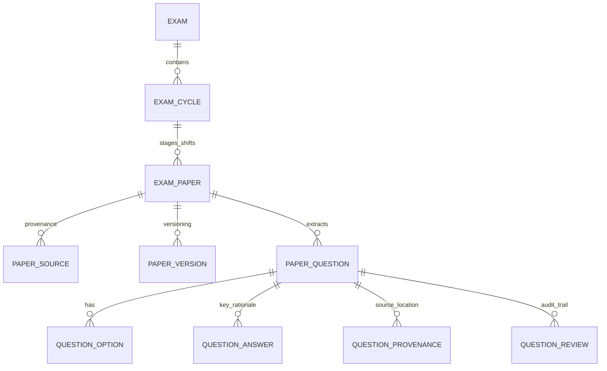
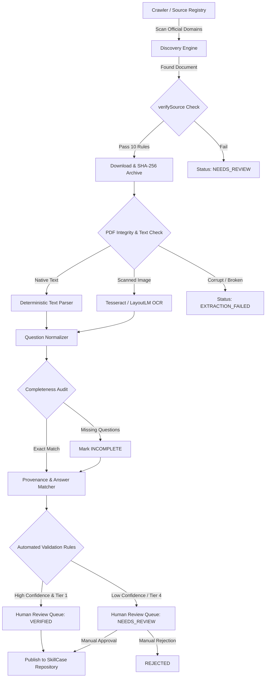

# SkillCase Verified PYQ Architecture & Ingestion System

> **Trust-Critical Directive:** *Prefer EMPTY BUT TRUE over FULL BUT FABRICATED.*  
> SkillCase must never present a generated, reconstructed, guessed, or memory-based question as an official previous-year question unless it is explicitly labeled as memory-based.

---

## 1. Executive Summary & Philosophy

SkillCase transforms Previous Year Question Papers (PYQs) from hardcoded static mock lists into a **source-first, automated, cryptographically verified acquisition, ingestion, normalization, storage, and UI execution pipeline**.

### Core Tenets
1. **Source-First Integrity:** Every paper, question, option, answer, and rationale must trace back to an authenticated primary provenance record (`source_url`, `sha256`, `discovered_at`, `source_classification`).
2. **Strict Provenance Separation:** Official conducting body publications (`OFFICIAL_ORIGINAL`, `OFFICIAL_RESPONSE_KEY`, `OFFICIAL_QUESTION_BANK`, `OFFICIAL_ARCHIVE`) are visibly and structurally separated from community/coaching reconstructions (`OFFICIALLY_PUBLISHED_MEMORY_BASED`, `MEMORY_BASED_THIRD_PARTY`, `RECONSTRUCTED`).
3. **No Synthetic Fabrication:** Synthetic or LLM-generated questions are NEVER categorized as PYQs. If an official cycle's paper cannot be acquired, the system displays `"Official paper not located"` instead of generating synthetic placeholders.
4. **Preservation of Incompleteness:** If a paper has only 80 verified questions out of an expected 100, the system stores and displays `questions_available: 80, questions_expected: 100, completeness_status: INCOMPLETE`. Missing questions are never filled in.
5. **Deterministic Extraction & Normalization:** `original_question_text` is immutably preserved. Display adjustments (OCR artifact cleanups) are stored separately under `display_question_text` with documented `normalization_notes`.

---

## 2. Current State vs. Proposed State

| Architectural Dimension | Current State | Proposed State |
|---|---|---|
| **Data Representation** | Monolithic `ExamPaper[]` array with mixed mock/sample data in TypeScript constants. | Relational Hierarchy: `Exam` → `ExamCycle` → `Paper` → `PaperQuestion` → `QuestionAnswer`. |
| **Provenance Tracking** | Static boolean `officialKeyAvailable: true` without source URLs or hashes. | Immutable SHA-256 hash, authority URL, publication notice reference, and source tiering. |
| **Source Classification** | Binary `pyq` vs `mock`. | 8 Strict Enum Classifications (`OFFICIAL_ORIGINAL` down to `UNKNOWN`). |
| **Extraction Integrity** | Hardcoded sample questions. | Deterministic text/OCR extractor with original text preservation and review queues. |
| **Answer Key Provenance** | Binary correct option. | Provenance-backed answer status (`OFFICIAL`, `VERIFIED_SECONDARY`, `EXPERT_REVIEWED`, `UNVERIFIED`, `UNKNOWN`). |
| **Incomplete Papers** | Unaccounted for. | Explicit count auditing (`questions_available` vs `questions_expected`). |
| **Copyright / Distribution** | Generic download buttons. | 5-level licensing gating (`ALLOWED`, `OFFICIAL_PUBLIC_ACCESS_ONLY`, `LINK_ONLY`, etc.). |
| **Automation Pipeline** | Manual scripts. | Automated idempotent CLI suite (`pyq:discover`, `pyq:download`, `pyq:extract`, `pyq:validate`, `pyq:review`, `pyq:publish`, `pyq:sync`). |
| **UI Experience** | Basic list view with immediate mock test modal. | Authentic Original Paper Viewer + CBT Full Paper Simulation Mode + Exam Coverage Matrix. |

---

## 3. Data Model & Entity Hierarchy



### Key Schemas

#### `exam_cycles`
- `cycle_id`: String (e.g. `norcet-7`, `rrb-cen-02-2024`, `esic-rt-2024`)
- `exam_id`: String (FK to `exams.id`)
- `cycle_name`: String (`AIIMS NORCET 7`, `RRB CEN 02/2024`)
- `year`: Integer (`2024`)
- `notification_date`: Date
- `exam_date`: Date
- `conducting_authority`: String (`AIIMS New Delhi`, `Railway Recruitment Boards`)

#### `exam_papers`
- `paper_id`: String (UUID / deterministic slug)
- `cycle_id`: String (FK to `exam_cycles.cycle_id`)
- `exam_id`: String (FK to `exams.id`)
- `year`: Integer
- `stage`: Enum (`PRELIMS`, `MAINS`, `SINGLE_STAGE`, `ENTRANCE`, `INTERVIEW_SCREENING`)
- `shift`: String (`Shift 1`, `Shift 2`, `Morning`, `Evening`, `N/A`)
- `language`: Enum (`ENGLISH`, `HINDI`, `BILINGUAL`, `REGIONAL`)
- `paper_type`: Enum (`REGULAR_EXAM`, `MODEL_PREDICTOR`, `SAMPLE_OFFICIAL`)
- `source_classification`: Enum (8 values)
- `source_tier`: Enum (`TIER_1_OFFICIAL`, `TIER_2_GOV_ARCHIVE`, `TIER_3_TRUSTED_SECONDARY`, `TIER_4_MEMORY_BASED`, `TIER_5_NEVER_PUBLISH`)
- `official_source_url`: String
- `original_file_path`: String (`/papers/nursing/norcet/norcet-7/stage-1/shift-1/original.pdf`)
- `sha256`: String (64-char hex)
- `page_count`: Integer
- `question_count`: Integer (extracted count)
- `expected_question_count`: Integer (official blueprint total)
- `completeness_status`: Enum (`COMPLETE`, `INCOMPLETE`, `PARTIAL_INDEXED`)
- `verification_status`: Enum (`DISCOVERED`, `DOWNLOADED`, `EXTRACTED`, `NORMALIZED`, `AUTO_VALIDATED`, `NEEDS_REVIEW`, `VERIFIED`, `PUBLISHED`, `REJECTED`)
- `redistribution_status`: Enum (`ALLOWED`, `OFFICIAL_PUBLIC_ACCESS_ONLY`, `LINK_ONLY`, `LICENSE_UNKNOWN`, `RESTRICTED`)
- `verified_at`: Timestamp
- `verified_by`: String

#### `paper_questions`
- `question_id`: String (UUID)
- `paper_id`: String (FK to `exam_papers.paper_id`)
- `canonical_question_id`: String (for cross-year tracking)
- `question_number`: Integer
- `section`: String (`Medical-Surgical`, `Obstetrics`, `Pharmacology`, `General Aptitude`)
- `question_text_original`: Text (Untouched source text)
- `question_text_display`: Text (Cleaned OCR artifacts)
- `normalization_notes`: Text
- `option_a`: Text
- `option_b`: Text
- `option_c`: Text
- `option_d`: Text
- `option_e`: Text (Nullable)
- `correct_option`: Enum (`A`, `B`, `C`, `D`, `E`, `NULL`)
- `answer_status`: Enum (`OFFICIAL`, `VERIFIED_SECONDARY`, `EXPERT_REVIEWED`, `UNVERIFIED`, `UNKNOWN`)
- `answer_source`: Text
- `answer_source_url`: String
- `explanation`: Text (Clinical / INC rationale)
- `page_reference`: Integer
- `source_text_hash`: String (SHA-256 of original raw snippet)
- `extraction_confidence`: Float (0.00 – 1.00)
- `review_status`: Enum (`AUTO`, `HUMAN_APPROVED`, `FLAGGED`)

---

## 4. Source Hierarchy & Classification Matrix

```
┌─────────────────────────────────────────────────────────────┐
│ TIER 1: OFFICIAL CONDUCTING BODIES                          │
│ AIIMS Exams, RRB Apply, UPSC, DSSSB, JIPMER, State PSCs    │
│ Classifications: OFFICIAL_ORIGINAL, OFFICIAL_RESPONSE_KEY, │
│                  OFFICIAL_QUESTION_BANK, OFFICIAL_ARCHIVE   │
└──────────────────────────────┬──────────────────────────────┘
                               │
┌──────────────────────────────▼──────────────────────────────┐
│ TIER 2: AUTHORITATIVE GOVERNMENT REPOSITORIES               │
│ e-Gazette, State Health Dept archives, Digital Libraries    │
│ Classification: OFFICIAL_ARCHIVE                            │
└──────────────────────────────┬──────────────────────────────┘
                               │
┌──────────────────────────────▼──────────────────────────────┐
│ TIER 3: TRUSTED SECONDARY SOURCES                           │
│ Reputable academic publishers, official RTI disclosure sets │
│ Classification: OFFICIALLY_PUBLISHED_MEMORY_BASED           │
└──────────────────────────────┬──────────────────────────────┘
                               │
┌──────────────────────────────▼──────────────────────────────┐
│ TIER 4: MEMORY-BASED RECONSTRUCTIONS                        │
│ Community recalls, nursing educators, candidate submissions │
│ Classifications: MEMORY_BASED_THIRD_PARTY, RECONSTRUCTED    │
│ Label: Prominently tagged "~ Memory-Based Reconstruction"   │
└──────────────────────────────┬──────────────────────────────┘
                               │
┌──────────────────────────────▼──────────────────────────────┐
│ TIER 5: NEVER PUBLISH / REJECTED                            │
│ Synthetic LLM hallucinations, unverified random blog posts  │
│ Action: Hard-rejected at ingestion gate                     │
└─────────────────────────────────────────────────────────────┘
```

---

## 5. Automated Discovery, Verification & Ingestion Pipeline



### 10-Point `verifySource(doc)` Gate
1. **Domain Whitelist:** Must match registered authority domain or verified Gov subdomain.
2. **Authority Context:** Landing page must contain official header, circular number, or notice identifier.
3. **Document Lineage:** PDF download link must resolve to the whitelisted domain without unverified redirects.
4. **Examination ID:** Text header must match targeted examination regex.
5. **Cycle / Year Alignment:** Year in document must correspond strictly to exam cycle dates.
6. **Stage & Shift Integrity:** Stage (Prelims/Mains) and Shift (Morning/Evening/1/2/3) must match official notice.
7. **Content Structural Check:** Must contain question items (numbered lists, option markers A/B/C/D).
8. **Document Completeness:** No truncated page streams or empty EOF markers.
9. **Official Master Key Circular Evidence:** If answer key is attached, notice number must be recorded.
10. **Redistribution Rights Audit:** Determine if document is freely distributable or strictly `LINK_ONLY`.

---

## 6. CLI Command Suite

| Command | Purpose | Idempotency Rule |
|---|---|---|
| `npm run pyq:discover` | Scans registered official domains and archives for candidate PDFs. | Upserts candidate metadata by `(exam_id, cycle_id, url_hash)`. |
| `npm run pyq:download` | Downloads verified candidate PDFs to immutable local storage. | Skips download if file exists with matching SHA-256. |
| `npm run pyq:extract` | Parses PDF text layer into structured question items. | Skips extraction if `source_text_hash` matches existing version. |
| `npm run pyq:validate` | Runs 10-point audit, duplicate detection, and answer key cross-reference. | Re-evaluates validation flags without mutating raw text. |
| `npm run pyq:review` | Launches CLI interactive review queue for flagged items. | Records `verified_by` and `verified_at` timestamps. |
| `npm run pyq:publish` | Promotes `VERIFIED` papers to the active SkillCase feed. | Generates static JSON feeds and updates coverage matrix. |
| `npm run pyq:sync` | Executes safe end-to-end pipeline (`discover` → `download` → `extract` → `validate` → `publish`). | 100% idempotent safe execution. |

---

## 7. Maya Retrieval Engine Architecture

Maya must strictly query the verified structured dataset:
- **Rule 1 (Zero Hallucination):** When a nurse asks for PYQ questions, Maya executes a structured vector/SQL query against `paper_questions` where `review_status = 'VERIFIED'`.
- **Rule 2 (Mandatory Provenance Citation):** Every question returned by Maya includes:
  `"Source: [Exam Name] [Year] [Stage/Shift] • Official Key Verified"`
- **Rule 3 (Practice Question Disambiguation):** If synthetic practice questions are generated on request, Maya prefixes:
  `"⚠️ SkillCase Generated Practice Question — Not an official previous-year question."`
- **Rule 4 (No Answer Guessing):** If a question's `answer_status = 'UNKNOWN'`, Maya explicitly states `"Official answer key not verified for this question"`.

---

## 8. Coverage Matrix & Machine-Readable Reporting

The system generates an automated markdown and JSON matrix (`docs/pyq_coverage.md` and `public/data/pyq-coverage-matrix.json`):

| Exam Name | 2020 | 2021 | 2022 | 2023 | 2024 | 2025/2026 | Verified Papers | Questions Total |
|---|---|---|---|---|---|---|---|---|
| **AIIMS NORCET** | 🟡 | 🟡 | 🟡 | 🟢 | 🟢 | 🟢 (Mock) | 4 Official / 4 Recall | 480 |
| **RRB Staff Nurse** | — | — | — | — | 🟢 | 🟢 (Mock) | 2 Official | 200 |
| **UPSC ESIC** | — | — | — | — | 🟢 | 🟢 (Mock) | 1 Official | 100 |
| **DSSSB Nursing Officer** | — | 🟢 | — | — | 🟢 | 🟢 (Mock) | 2 Official | 400 |
| **MNS Military Nursing** | — | — | — | 🟢 | 🟢 | 🟢 (Mock) | 2 Official | 300 |
| **State PSCs (25 Exams)** | — | — | 🟢 | 🟢 | 🟢 | 🟢 (Mock) | 25 Official | 2,750 |
